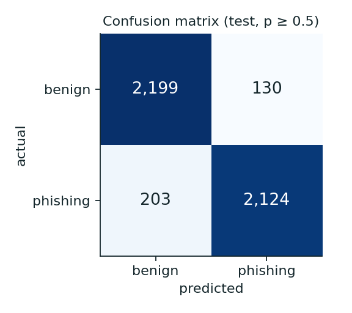
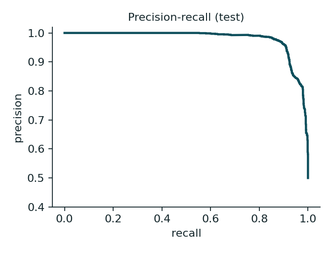
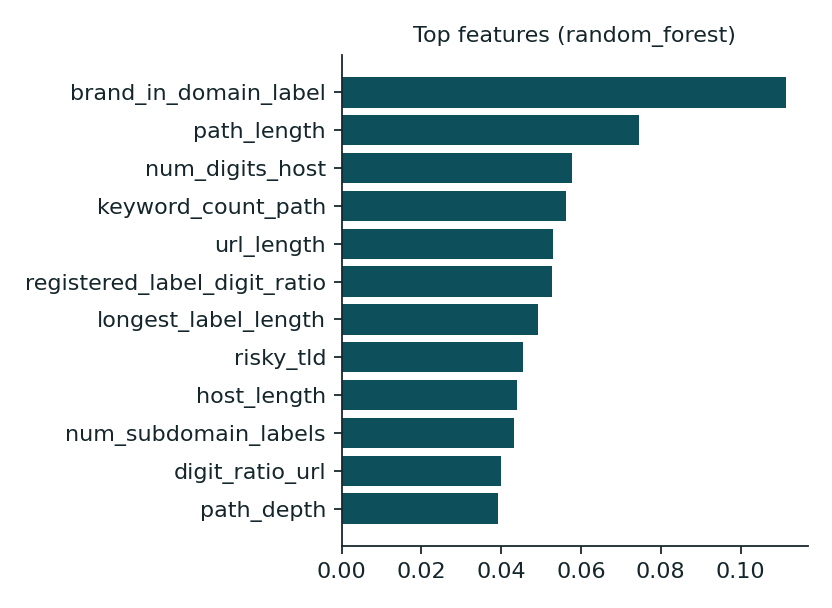

# ML report

> Trained on SYNTHETIC data: these numbers describe how well the pipeline learned the generator's patterns, NOT real-world phishing detection. Retrain on real labelled data (see ml/dataset/build_dataset.py).

Model version: `20260920-random_forest` · selected: **random_forest** (sigmoid (fitted on validation split)) ·
scikit-learn 1.8.0 · trained 2026-09-20

## 1. Data and split

| | rows | domains |
|---|---|---|
| train | 15,473 | 6,483 |
| validation | 3,559 | 1,497 |
| test | 4,656 | 1,996 |

Source: `synthetic-v2` (11,933 phishing / 11,755 benign). Split strategy:
GroupShuffleSplit by registered domain (no domain appears in more than one split; asserted in the training script).
Features: 37 lexical URL features computed by the same function the API uses (`backend/services/features.py`).

## 2. Model comparison (test split, threshold 0.5, uncalibrated)

| model | precision | recall | F1 | PR-AUC | FPR | FNR | accuracy |
|---|---|---|---|---|---|---|---|
| logistic regression | 0.890 | 0.809 | 0.847 | 0.939 | 0.100 | 0.191 | 0.854 |
| decision tree | 0.867 | 0.854 | 0.861 | 0.925 | 0.131 | 0.146 | 0.862 |
| random forest | 0.958 | 0.905 | 0.931 | 0.981 | 0.040 | 0.095 | 0.933 |

Selection used validation F1 (ties: average precision). Accuracy is shown for completeness only.

## 3. Final model (calibrated) on the test split

| precision | recall | F1 | PR-AUC | ROC-AUC | Brier | FPR | FNR |
|---|---|---|---|---|---|---|---|
| 0.942 | 0.913 | 0.927 | 0.981 | 0.977 | 0.056 | 0.056 | 0.087 |

 

Threshold sweep:

| threshold | precision | recall | F1 | FPR |
|---|---|---|---|---|
| 0.3 | 0.908 | 0.923 | 0.915 | 0.094 |
| 0.5 | 0.942 | 0.913 | 0.927 | 0.056 |
| 0.7 | 0.962 | 0.899 | 0.930 | 0.035 |
| 0.9 | 0.984 | 0.850 | 0.912 | 0.014 |

## 4. Error analysis (synthetic test split)

Highest-confidence **false positives** (benign scored as phishing):

- `https://wolfflint.com/about` (p=0.98)
- `https://zenithhealth.com/terms` (p=0.98)
- `https://workssummit.org/faq` (p=0.98)
- `https://timberraven.com/terms` (p=0.98)
- `https://www.tideember6.net/r/303h5p` (p=0.98)
- `https://arbor8gz9i.web.app/faq` (p=0.98)
- `https://tech0a14.vercel.app/` (p=0.98)
- `https://grove4t5xj2.glitch.me/privacy` (p=0.98)

Highest-confidence **false negatives** (phishing scored as benign):

- `https://www.hscb.org/recover` (p=0.03)
- `https://sites.google.com/view/finance-frost-trail` (p=0.03)
- `https://sites.google.com/view/alpha-global-timber` (p=0.03)
- `https://sites.google.com/view/global-foods-pixel` (p=0.04)
- `https://sites.google.com/view/sage-horizon-lumen` (p=0.04)
- `https://sites.google.com/view/wolf-foods-vista` (p=0.04)
- `https://sites.google.com/view/ridge-otter-sand` (p=0.04)
- `https://sites.google.com/view/city-cloud-cloud` (p=0.04)

Mean of selected features per group (what do mistakes have in common?):

| group | n | is_https | is_shared_hosting | keyword_count_path | brand_in_path | is_shortener | path_depth |
|---|---|---|---|---|---|---|---|
| false positives | 130 | 0.77 | 0.25 | 0.29 | 0.01 | 0.00 | 1.57 |
| false negatives | 203 | 0.96 | 0.01 | 0.04 | 0.00 | 0.00 | 3.21 |
| correct phishing | 2,124 | 0.61 | 0.18 | 0.61 | 0.00 | 0.00 | 1.41 |
| correct benign | 2,199 | 0.89 | 0.11 | 0.18 | 0.01 | 0.00 | 2.08 |

## 5. Reality check on real URLs

The synthetic test split above says how well the model learned the generator. It says
*nothing* about real phishing. So the model was also scored on **real URLs it never trained on**:

* phishing: a snapshot of the public OpenPhish community feed, split into a **dev** half
  (first 150 URLs, inspected while improving the generator) and a **holdout** half (last 150,
  scored only after tuning was finished);
* benign: 89 hand-picked real URLs (**dev**, inspected while tuning) and 79 more (**holdout**,
  written after tuning without consulting model output), including login and account pages.

Full offline pipeline (classifier + URL rules + prior-shift correction at
`assumed_prevalence=0.3`), **without** domain-age, TLS or
threat-intelligence signals, which add detection on top of these figures:

| slice | n | flagged medium or high | flagged high |
|---|---|---|---|
| benign (dev) | 89 | 0.0% | 0.0% |
| benign (holdout) | 77 | 5.2% | 0.0% |
| phishing (dev) | 150 | 60.0% | 31.3% |
| phishing (holdout) | 150 | 48.7% | 20.0% |

Reading this honestly:

* **Recall on real phishing is far below the synthetic number** (roughly half of holdout URLs
  reach "suspicious", about a fifth "high risk"). Many real phishing URLs are lexically
  indistinguishable from ordinary sites (`fortgrind.com/`, a Blogspot subdomain, a random
  path on a compromised site). A URL-only model cannot see them; that is exactly why the
  design layers domain age, certificate checks and threat intelligence on top.
* **False alarms are the bigger product risk.** The classifier is trained on a 50/50 mix, but
  real browsing is overwhelmingly benign, so raw probabilities overstate risk. At even a 5% false
  positive rate and ~1% real prevalence, most warnings would be false. The risk engine therefore
  applies a prior-shift correction; the dev sweep behind the default is in `docs/scoring.md`.
* Remaining benign false alarms are free-hosting personal sites (`*.netlify.app`, `*.github.io`).
  They can only reach "suspicious" (never "high") without corroborating evidence.
* The benign sets are small (89 and 79 URLs), so these percentages have wide error bars
  (roughly +/-5 points). Treat this as a smoke test, not a benchmark.
* The holdout phishing half shares a snapshot (and therefore some campaigns) with the dev half.
  The failure categories were first observed on a run over the whole snapshot before it was split,
  so the holdout figures are slightly optimistic.

